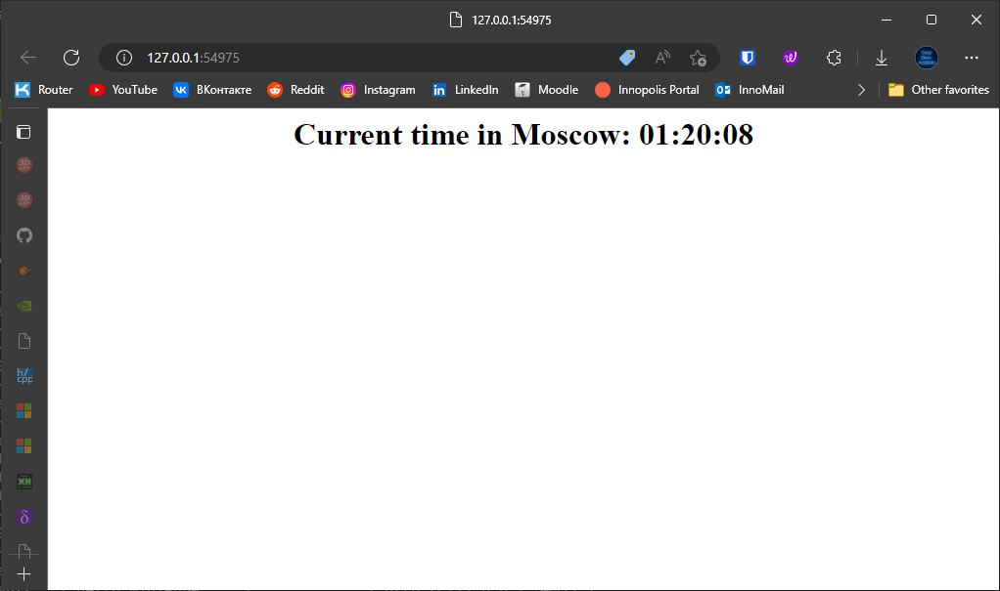

# Kubernetes

List of Pods and Services created __without config files__:

```ps
Δ kubectl get pods,svc
NAME                                   READY   STATUS    RESTARTS      AGE
pod/app-python-node-597954df58-pthhn   1/1     Running   0             4m9s
pod/hello-minikube-77b6f68484-6tgkc    1/1     Running   1 (25m ago)   26m

NAME                      TYPE           CLUSTER-IP       EXTERNAL-IP   PORT(S)          AGE
service/app-python-node   LoadBalancer   10.110.247.118   <pending>     5000:32349/TCP   2m42s
service/hello-minikube    NodePort       10.109.181.242   <none>        8080:30112/TCP   26m
service/kubernetes        ClusterIP      10.96.0.1        <none>        443/TCP          30m
```
After using config files `deployment.yaml` and `service.yaml`:
```ps
┏Δ kubectl get pods,svc
NAME                                        READY   STATUS    RESTARTS      AGE
pod/app-python-deployment-98db7498d-7s9cr   1/1     Running   0             26m
pod/app-python-deployment-98db7498d-fl9bz   1/1     Running   0             26m
pod/app-python-deployment-98db7498d-vml8h   1/1     Running   0             26m
pod/hello-minikube-77b6f68484-6tgkc         1/1     Running   1 (61m ago)   62m

NAME                         TYPE           CLUSTER-IP       EXTERNAL-IP   PORT(S)          AGE
service/app-python-service   LoadBalancer   10.97.171.38     <pending>     5000:31604/TCP   22m
service/hello-minikube       NodePort       10.109.181.242   <none>        8080:30112/TCP   62m
service/kubernetes           ClusterIP      10.96.0.1        <none>        443/TCP          65m
```
Running all services:
```ps
Δ minikube service --all
|-----------|--------------------|-------------|---------------------------|
| NAMESPACE |        NAME        | TARGET PORT |            URL            |
|-----------|--------------------|-------------|---------------------------|
| default   | app-python-service |        5000 | http://192.168.49.2:31604 |
|-----------|--------------------|-------------|---------------------------|
|-----------|----------------|-------------|---------------------------|
| NAMESPACE |      NAME      | TARGET PORT |            URL            |
|-----------|----------------|-------------|---------------------------|
| default   | hello-minikube |        8080 | http://192.168.49.2:30112 |
|-----------|----------------|-------------|---------------------------|
|-----------|------------|-------------|--------------|
| NAMESPACE |    NAME    | TARGET PORT |     URL      |
|-----------|------------|-------------|--------------|
| default   | kubernetes |             | No node port |
|-----------|------------|-------------|--------------|
😿  service default/kubernetes has no node port
🏃  Starting tunnel for service app-python-service.
🏃  Starting tunnel for service hello-minikube.
🏃  Starting tunnel for service kubernetes.
|-----------|--------------------|-------------|------------------------|
| NAMESPACE |        NAME        | TARGET PORT |          URL           |
|-----------|--------------------|-------------|------------------------|
| default   | app-python-service |             | http://127.0.0.1:54975 |
| default   | hello-minikube     |             | http://127.0.0.1:54977 |
| default   | kubernetes         |             | http://127.0.0.1:54980 |
|-----------|--------------------|-------------|------------------------|
🎉  Opening service default/app-python-service in default browser...
🎉  Opening service default/hello-minikube in default browser...
🎉  Opening service default/kubernetes in default browser...
❗  Because you are using a Docker driver on windows, the terminal needs to be open to run it.
```

Up and running:
